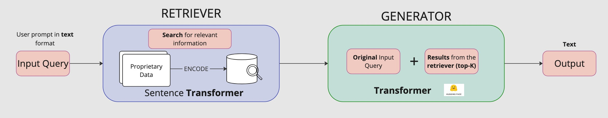

# Retrieval-Augmented Generation (RAG)
Retrieval-augmented generation (RAG) models are a smart way to add a context to the LLM (pre-trained large language models). They can help improve the quality of generated text by providing LLMs with context that comes from your own custom data. Using RAG leads to higher accuracy and better robustness in your text generation system. 

In this notebook, I am using Covid-19 Clinical Trial data to enhance the relevance and quality of the generated text. 

## How do RAGs work
Typically RAG consist of two core modules: the retriever and the generator. The retriever searches for relevant information from the provided data. The generator produces the required content.

More specifically the process;
1. take the input query
2. using a sentence transformer (small language model) search for relevant information. Transformer models are one of the best performing in NLP.
3. Take the top-k (top 3 in this notebook) results
4. Pass the output of the query, together with the original query to the generator. 



## Installation 

```python3 -m venv .venv ```
```source .venv/bin/activate ``` 
```.venv/bin/pip install -r requirements.txt ```

## Libraries
- [Pandas](https://pandas.pydata.org/): data manipulation
- [qdrant-client](https://github.com/qdrant/qdrant): vector similariy seach engine and vector database
- [Sentence Transformers](https://pypi.org/project/sentence-transformers/): framework to computer dense erctor represetnation for sentences, paragraphs and images. The models are based on transformers like BERT / RoBERTa / XLM-RoBERTa. 
- [Llamafile](https://github.com/Mozilla-Ocho/llamafile): Run LLM with a single file
- [OpenAI](https://pypi.org/project/openai/): connect to LLM from openAI

## Data 
I used the publicly available [Coronavirus Clinical Trials Dataset](https://www.kaggle.com/datasets/zohrarezgui/coronavirus-clinical-trials-dataset) from Kaggle. The dataset includes exclusion and inclusion criteria for covid-19 clinical trials that were downloaded from ct.gov. 

## Large and Small Language Models 
The __Retriever__ is using the [multi-qa-MiniLM-L6-cos-v1](https://www.sbert.net/docs/sentence_transformer/pretrained_models.html) small language model. This model is great for diverse use-cases and is trained on a dataset of over 1 billion training pairs. 

The __Generator__ is using Phi-2 model from HuggingFace. There is a great blog in Microsoft Research about [The pusrising power of small language models](https://www.microsoft.com/en-us/research/blog/phi-2-the-surprising-power-of-small-language-models/)

